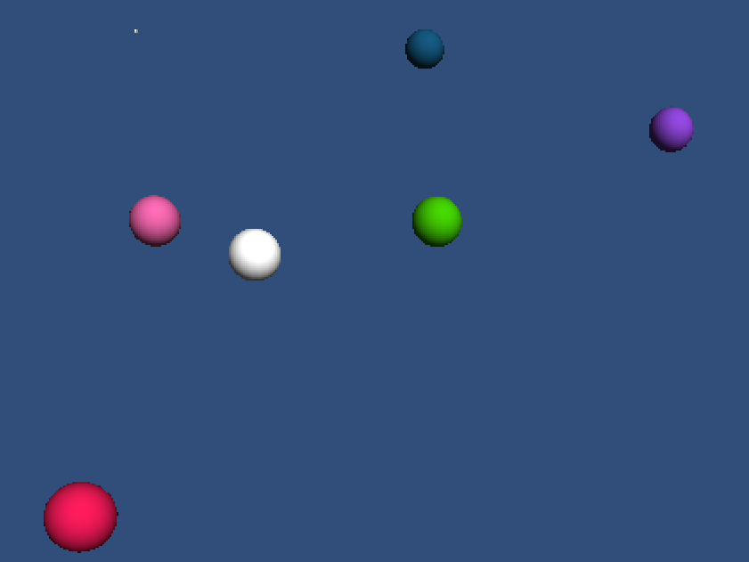

HFT-Unity Simple Example
========================

This is a sample Unity3D game for the [HappyFunTimes party games system](http://greggman.github.io/HappyFunTimes).

It simply shows spawning a sphere each time a player joins and controlling the position of the sphere
but dragging your finger on the screen.

If you just want to play go to http://superhappyfuntimes.net/game/unitysimpleexample

Cloning
-------

[If you want to clone this follow the instructions here](https://github.com/greggman/HappyFunTimes/blob/master/docs/unitydocs.md)

