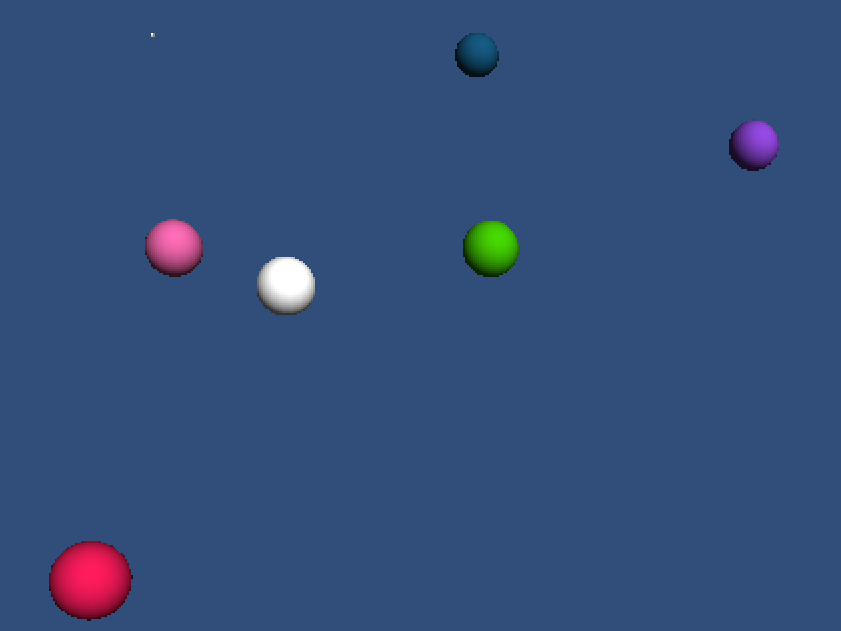

HFT-Unity Simple Example
========================

This is a sample Unity3D game for the [HappyFunTimes party games system](http://greggman.github.io/HappyFunTimes).

It simply shows spawning a sphere each time a player joins and controlling the position of the sphere
but dragging your finger on the screen.

If you just want to play go to http://superhappyfuntimes.net/game/unitysimpleexample

Cloning
-------

Prerequisites

*   node.js http://nodejs.org
*   bower http://bower.io
*   happyfuntimes http://superhappyfuntimes.net/install
*   hft-cli http://github.com/greggman/hft-cli

If you clone this you'll need follow the following steps

1.  install happyfuntimes from http://superhappyfuntimes.net/install
2.  install hft-cli by typing `sudo npm install -g hft-cli` or in windows just `npm install -g hft-cli`
3.  clone this repo
4.  After cloning cd to the folder you just cloned into and type `bower install`
5.  edit `package.json` and change the `gameId` to some other id.
6.  type `hft add` which will add this to happyFunTimes.

